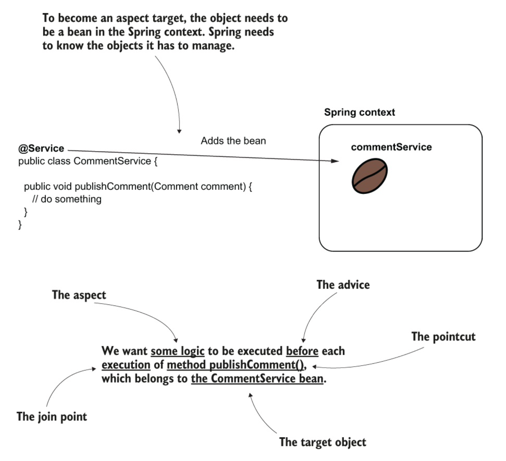
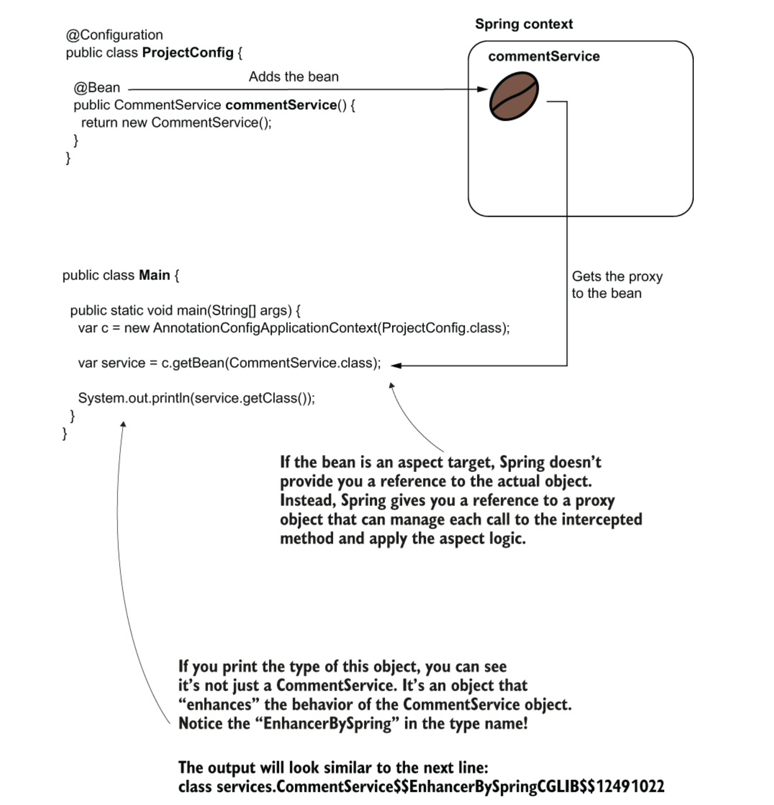
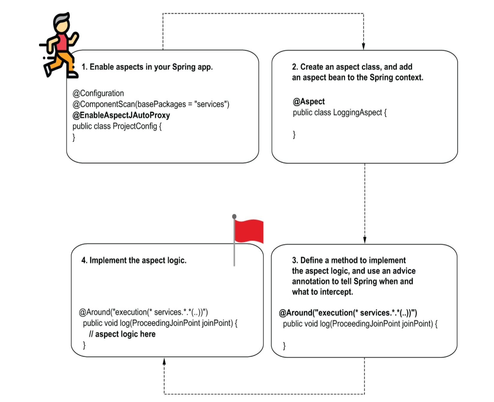
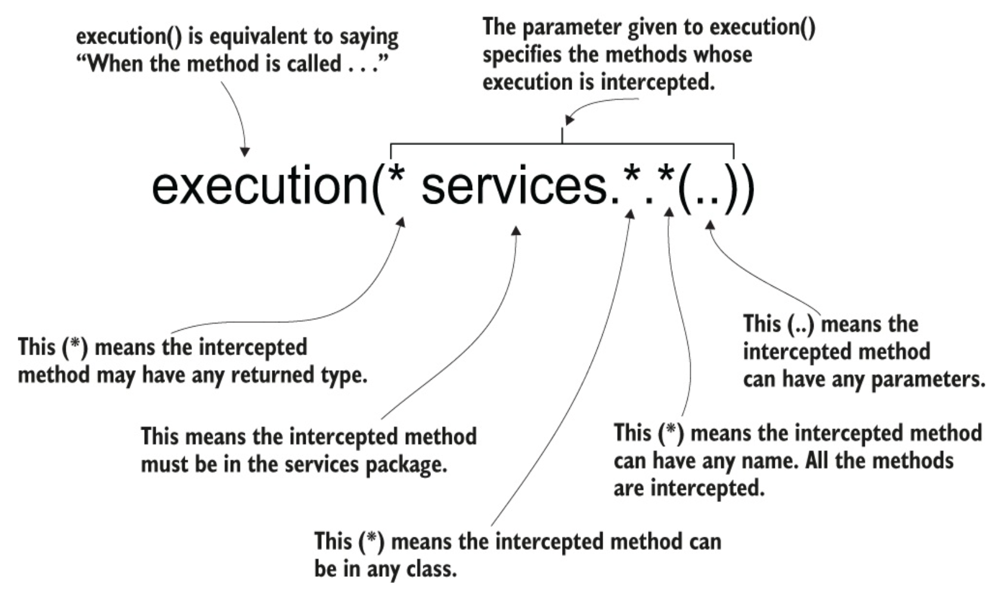
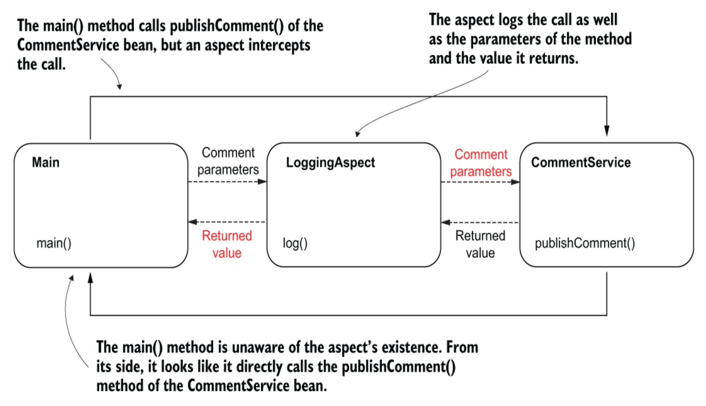

## Using Aspects with Spring AOP

`Aspects` are a way the framework `intercepts` method calls and possibly `alters` the execution of methods.

You can modify the execution of specific method calls you select.

This technique helps you extract part of the logic belonging to the executing method.

It allows the developer to focus only on the relevant details discussed when reading the method logic.

This approach is called aspect-oriented programming (AOP).

---

### Why Aspects ?

Spring uses them in implementing a lot of the crucial capabilities it offers.

A pertinent example of Spring capability that uses aspects is `transactionality`.

Another important capability relying on aspects is `security configurations`

---

## How aspects work in Spring

In this section, you’ll learn how aspects work and the essential terminology you’ll encounter when using aspects.

An aspect is simply a piece of logic the framework executes when you call specific methods of your choice.

When designing an aspect, you define the following:

- What code you want Spring to execute when you call specific methods. This is named an `aspect`.

- When the app should execute this logic of the aspect (e.g., before or after the method call, instead of the method call). This is named the `advice`.

- Which `methods` the framework needs to intercept and execute the aspect for them. This is named a `pointcut`.

### Join Point

A join point, which defines the event that triggers the execution of an aspect. But with Spring, this event is always a method call.

To use `aspects` you need the framework to manage the objects for which you want to apply aspects.

### Target object

The bean that declares the method intercepted by an aspect is named the target object.

---

## The aspect terminology

Spring executes some logic (the `aspect`) when someone calls a specific method (the `pointcut`).

We need to specify when the logic is executed according to the `pointcut` (e.g., before).

The when is the `advice`.

For Spring to intercept the method, the object that defines the intercepted method needs to be a bean in the Spring context.

So, the bean becomes the target object of the aspect.

Example



---

### How does Spring intercept each method call and apply the aspect logic?

The object needs to be a bean in the Spring context.

But because you made the object an aspect target, Spring won’t directly give you an instance reference for the bean when you request it from the context.

Instead, Spring gives you an object that calls the aspect logic instead of the actual method.

We say that Spring gives you a proxy object instead of the real bean.

You will now receive the `proxy` instead of the bean anytime you get the bean from the context, either if you directly use the getBean() method of the
context or if you use DI.

This approach is named `weaving`.

---

## Weaving

Weaving an aspect. Instead of giving you a reference to the real bean, Spring gives you a reference to a proxy object, intercepts the method calls, and manages the aspect logic.



---

When a method isn’t aspected, the call goes directly to that method.

When we define an aspect for a method, the call goes through the proxy object.

The proxy object applies the logic defined by the aspect and then delegates the call to the real method.

---

## Implementing aspects with Spring AOP

In this section, you’ll learn the most relevant aspect syntaxes used in real-world examples.

Real World scenarios

Your app requires to store the time it started and ended for each use case execution.

for implementing a functionality to log all the events where a use case begins and ends.

## Implementing a simple aspect

Create a new project and add the spring- context dependency and the spring-aspects dependency.

Make sure to update your pom.xml file and add the needed dependencies, as presented in the next code snippet:

```xml
<dependency>
   <groupId>org.springframework</groupId>
   <artifactId>spring-context</artifactId>
   <version>5.2.8.RELEASE</version>
</dependency>

<dependency>
 <groupId>org.springframework</groupId>
 <artifactId>spring-aspects</artifactId>
<version>5.2.8.RELEASE</version>
</dependency>
```

Example App

### Model

```java
@Data
public class Comment {
	private String text;
	private String author;
}
```

### Service

- We use the stereotype annotation to make this a bean in the Spring context.
- To log a message in the app’s console every time someone calls the use case, we use a logger object.
- This method defines the use case for our demonstration.

```java
@Service
public class CommentService {
	private Logger logger = Logger.getLogger(CommentService.class.getName());
	public void pushComment(Comment comment) {
		logger.info("Publishing comment : " + comment.getText());
	}
}
```

### Configuration

- We use `@ComponentScan` to tell Spring where to search for classes annotated with stereotype annotations.

```java
@Configuration
@ComponentScan(basePackages = "service")
public class ProjectConfig {}
```

### Main Class

- Gets the CommentService bean from the context
- Creates a Comment instance to give as a parameter to the publishComment() method
- Calls the publishComment() method

```java
var context = new AnnotationConfigApplicationContext(ProjectConfig.class);
var service = context.getBean(CommentService.class);
Comment comment = new Comment();
comment.setText("Demo comment");
comment.setAuthor("Natasha");
service.pushComment(comment);
```

Now enhance the project with an aspect class that intercepts the method call and adds an output before and after the call.

### To create an aspect, you follow these steps:

1. Enable the aspect mechanism in your Spring app by annotating the configuration class
   with the @EnableAspectJAutoProxy annotation.
2. Create a new class, and annotate it with the @Aspect annotation. Using either @Bean or stereotype annotations, add a bean for this class in the Spring context.
3. Define a method that will implement the aspect logic and tell Spring when and which methods to intercept using an advice annotation.
4. Implement the aspect logic.



---

STEP 1: ENABLING THE ASPECTS MECHANISM FOR YOUR APPLICATION

Use the @EnableAspectJAutoProxy annotation to enable the aspect capabilities.

```java
@Configuration
@ComponentScan(basePackages = "com.isaachome.service")
@EnableAspectJAutoProxy
public class ProjectConfig {}
```

STEP 2: CREATE A CLASS THAT DEFINES THE ASPECT, AND ADD AN INSTANCE FOR THIS CLASS IN THE SPRING CONTEXT

```java
@Aspect
public class LogginAspect {
	public void log(ProceedingJoinPoint joinPoint) {}
}
```

```java
@Bean
public LogginAspect logginAspect() {
	return new LogginAspect();
}
```

STEP 3: USE AN ADVICE ANNOTATION TO TELL SPRING WHEN AND WHICH METHOD CALLS TO INTERCEPT

Using an advice annotation to weave the aspect to specific methods

```java
@Aspect
public class LogginAspect {

    @Around("execution(* services.*.*(..))")
	public void log(ProceedingJoinPoint joinPoint) {
		joinPoint.proceed();
	}
}
```

- Defines which are the intercepted methods
- Delegates to the actual intercepted method

## @Around

`@Around` annotation tells Spring which method calls to intercept.

### Look at the expression



---

STEP 4: IMPLEMENT THE ASPECT LOGIC
In listing 6.6, I’ve added the logic for our aspect. Now the aspect

1. Intercepts the method
2. Displays something in the console before calling the intercepted method 3. Calls the intercepted method
3. Displays something in the console after calling the intercepted method

```java
@Aspect
public class LogginAspect {

	private Logger logger = Logger.getLogger(LogginAspect.class.getName());
	@Around("execution(* services.*.*(..))")
	public void log(ProceedingJoinPoint joinPoint) throws Throwable {
		logger.info("Method will execute");
		joinPoint.proceed();
		logger.info("Method  executed");
	}
}

```

- Prints a message in the console before the intercepted method’s execution
- Calls the intercepted method
- Prints a message in the console after the intercepted method’s execution

---

### Altering the intercepted method’s parameters and the returned value

`Aspects` are really powerful.They intercept a method and alter its execution.

They can also intercept the parameters used to call the method and possibly alter them or the value the intercepted method returns.

Log the parameters used to call the service method and what the method returned.

For demonstration, the method now returns a value.

```java

@Service
public class CommentService {
	private Logger logger = Logger.getLogger(CommentService.class.getName());

	public String updateComment(Comment comment) {
		logger.info("Updating comment : " + comment.getText());
		return "SUCCESS";
	}
}

```

The aspect can easily find the name of the intercepted method and the method parameters.

The `ProceedingJoinPoint` parameter of the aspect method represents the intercepted method.

`ProceedingJoinPoint` can get any information related to the intercepted method (parameters, method name, target object, and so on).

```java
String methodName = joinPoint.getSignature().getName();
Object [] arguments = joinPoint.getArgs();
```

### Obtaining the method name and parameters in the aspect logic

```java
@Aspect
public class LogginAspect {

	private Logger logger = Logger.getLogger(LogginAspect.class.getName());
	@Around("execution(* com.isaachome.services.*.*(..))")
	public Object log(ProceedingJoinPoint joinPoint) throws Throwable {
		String methodName = joinPoint.getSignature().getName();
		Object [] arguments = joinPoint.getArgs();

		logger.info("Method " + methodName +
				" with parameters " + Arrays.asList(arguments)
				+ " will execute.");

		Object returnByMethod =joinPoint.proceed();

		logger.info("Method  executed and returned " + returnByMethod);
		return returnByMethod;
	}
}
```

- Obtains the name and parameters of the intercepted method
- Logs the name and parameters of the intercepted method
- Calls the intercepted method
- Returns the value returned by the intercepted method

### Visualization of Aspect interception



The aspect intercepts the method call, so it can access the parameters and the value returned by the intercepted method after execution.

For the main() method, it looks like it directly calls the publishComment() method of the CommentService bean.

The caller isn’t aware that an aspect intercepted the call.

---

### Altering the parameters and the returned value

Aspects are even more powerful. They can alter the execution of the intercepted method by

- Changing the value of the parameters sent to the method
- Changing the returned value received by the caller
- Throwing an exception to the caller or catching and treating an exception thrown by the intercepted method

```java
@Aspect
public class LogginAspect {

	private Logger logger = Logger.getLogger(LogginAspect.class.getName());
	@Around("execution(* com.isaachome.services.*.*(..))")
	public Object log(ProceedingJoinPoint joinPoint) throws Throwable {
		String methodName = joinPoint.getSignature().getName();
		Object [] arguments = joinPoint.getArgs();

		logger.info("Method " + methodName +
				" with parameters " + Arrays.asList(arguments)
				+ " will execute.");
		Comment comment = new Comment();
		comment.setAuthor("IsaacHome");
		comment.setText("Intercepted Comment...");
		Object [] newArguments = {comment};

		Object returnByMethod =joinPoint.proceed(newArguments);

		logger.info("Method  executed and returned " + returnByMethod);
		return "FAILED";
	}
}
```

- We send a different comment instance as a value to the method’s parameter.
- We log the value returned by the intercepted method, but we return a different value to the caller.

---

## Intercepting annotated methods

Define a custom annotation and log only the execution of the methods using the custom annotation.

To achieve this objective, you need to do the following:

1. Define a custom annotation, and make it accessible at runtime. We’ll call this annotation `@ToLog`.

2. Use a different AspectJ pointcut expression for the aspect method to tell the aspect to intercept the methods annotated with the custom annotation.

### Custom annotation

```java
@Retention(RetentionPolicy.RUNTIME)
@Target(ElementType.METHOD)
public @interface ToLog {}
```

- Enables the annotation to be intercepted at runtime
- Restricts this annotation to only be used with methods

### We use the custom annotation for the methods we want the aspect to intercept

```java

@Service
public class CommentService {
	private Logger logger = Logger.getLogger(CommentService.class.getName());
	public void pushComment(Comment comment) {
		logger.info("Publishing comment : " + comment.getText());
	}

	@ToLog
	public void deleteComment(Comment comment) {
		logger.info("Deleting comment : " + comment.getText());
	}
	public void editingComment(Comment comment) {
		logger.info("Editing comment : " + comment.getText());
	}
}

```

### Weaving the aspect to the methods annotated with `@ToLog`

```java
@Aspect
public class LoggingAspect {
private Logger logger = Logger.getLogger(LoggingAspect.class.getName());
@Around("@annotation(ToLog)")
	public Object log(ProceedingJoinPoint joinPoint)throws Throwable {
		String methodName = joinPoint.getSignature().getName();
		Object [] arguments = joinPoint.getArgs();

		logger.info("Method " + methodName +
				" with parameters " + Arrays.asList(arguments)
				+ " will execute.");

		Object returnByMethod =joinPoint.proceed();

		logger.info("Method  executed and returned " + returnByMethod);
		return returnByMethod;
	}
}
```

---

### Other advice annotations you can use

Other than `@Around`, Spring offers the following advice annotations:

- `@Before`
  - Calls the method defining the aspect logic before the execution of the intercepted method.

- `@AfterReturning`
	- Calls the method defining the aspect logic after the method successfully returns, and provides the returned value as a parameter to the aspect method. The aspect method isn’t called if the intercepted method throws an exception.

- `@AfterThrowing`
	- Calls the method defining the aspect logic if the intercepted method throws an exception, and provides the exception instance as a parameter to the aspect method.

- `@After`
	- Calls the method defining the aspect logic only after the intercepted method execution, whether the method successfully returned or threw an exception.


---

### The aspect execution chain